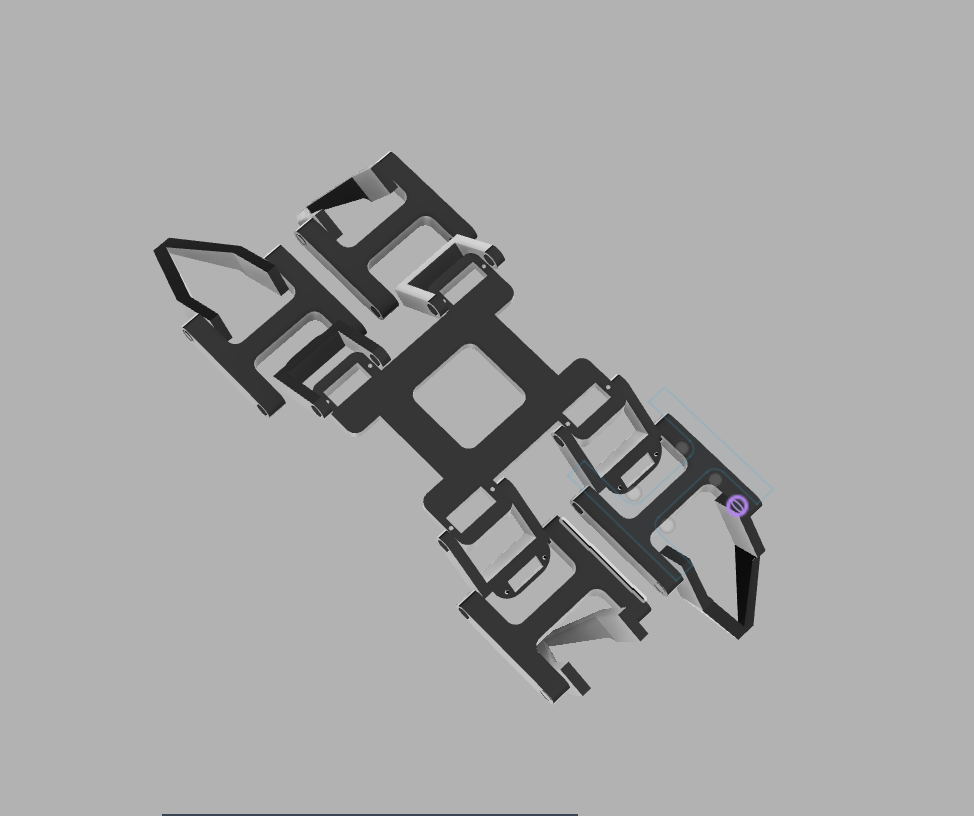
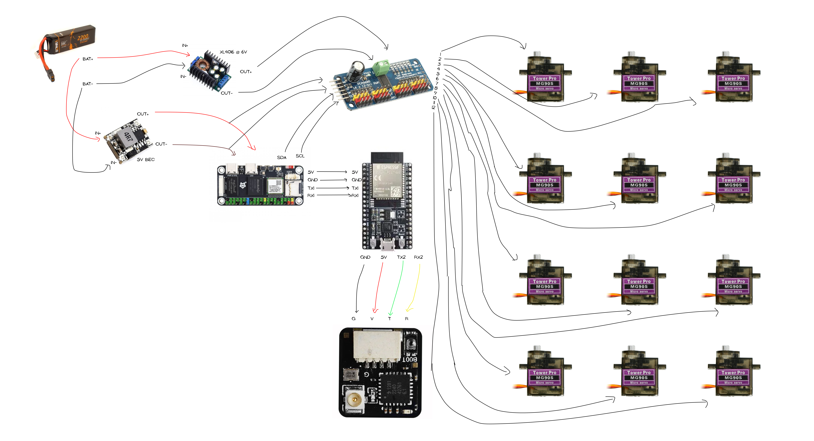
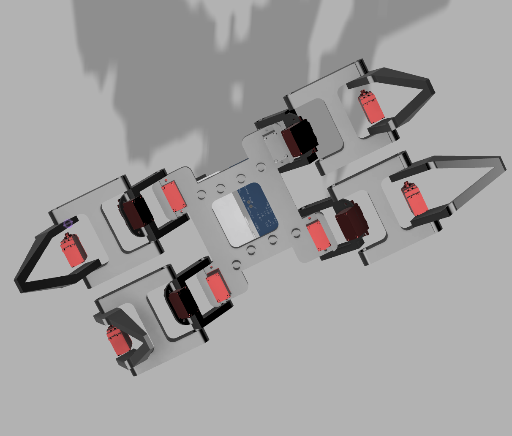
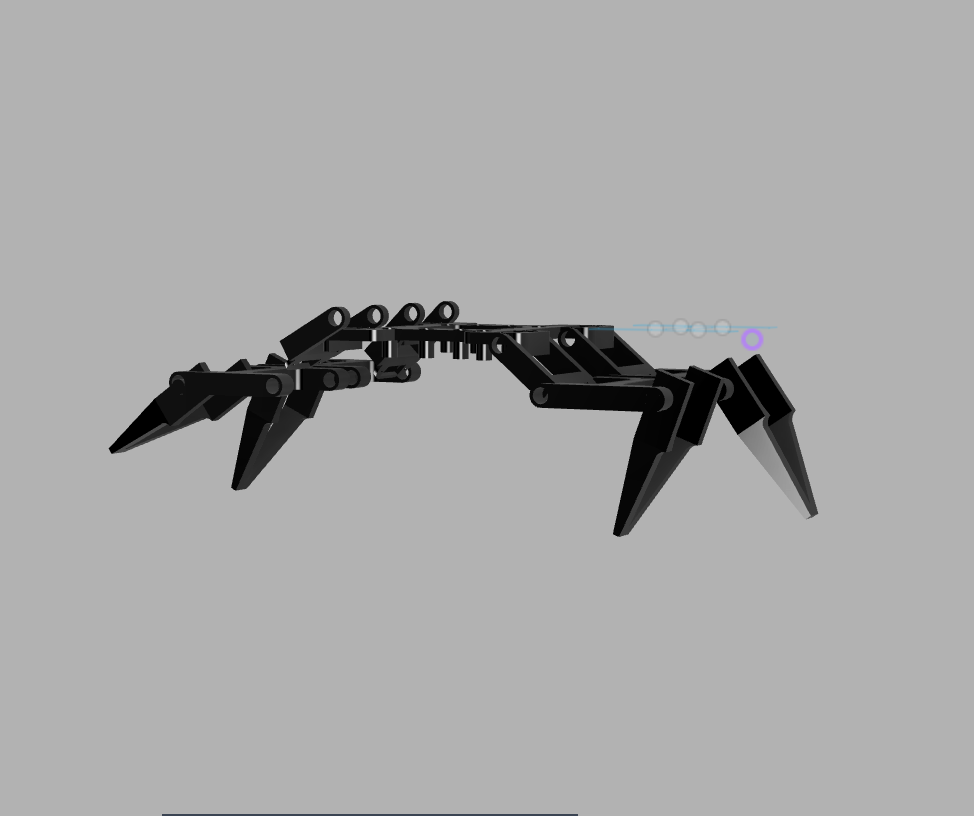

# argiope

Argiope is a **4-legged (quadruped) spider robot** with **12 degrees of freedom (DOF)**. Each leg has three servo-controlled joints: **coxa, femur, and tibia**, providing independent control over the leg position and movement.

The robot uses a **Luckfox Lyra Zero W** for gait calculation and high-level motion control, while an **ESP32 DevKit V1** handles the servo motors through **PCA9685 PWM servo drivers**.

## features

- **12 degrees of freedom**, 3 DOF per leg
- **Coxa, femur, and tibia** joints on each leg
- Tripod-style gait algorithm

## design

Argiope is designed around a four-legged configuration with three servo-controlled joints on each leg. The three joints are the **coxa, femur, and tibia**, allowing each leg to independently control its horizontal position, lift, and extension.

The mechanical structure is arranged symmetrically around the center of the robot to maintain balance and provide predictable movement.

The control system is split between two processors:

- **Luckfox Lyra Zero W** handles the gait algorithm, movement calculations, and high-level robot control.
- **ESP32 DevKit V1** receives movement commands from the Luckfox and controls the servos through the PCA9685.

This separation keeps gait computation independent from the low-level servo control.

### wiring

## CAD

Final 3D views of the Argiope quadruped robot.

|              Top view              |               Bottom view                |              Side view               |
| :--------------------------------: | :--------------------------------------: | :----------------------------------: |
|  |  |  |

The mechanical structure was designed to accommodate the four legs, servo motors, electronics, and required mounting points while maintaining a balanced and compact layout.

## BOM

The complete bill of materials is available in [`bom.csv`](bom.csv).
